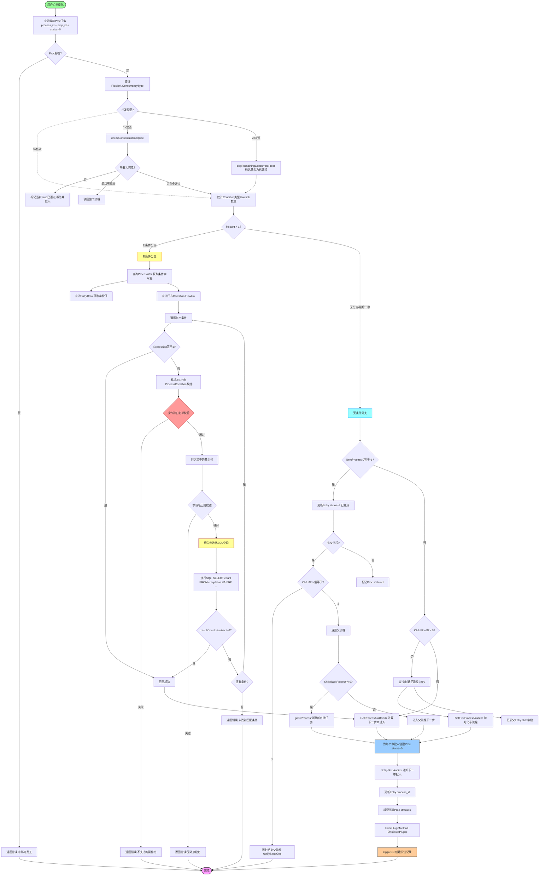
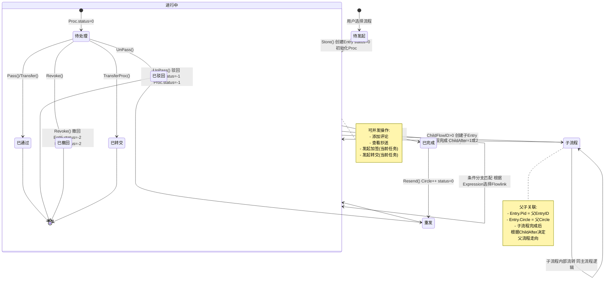
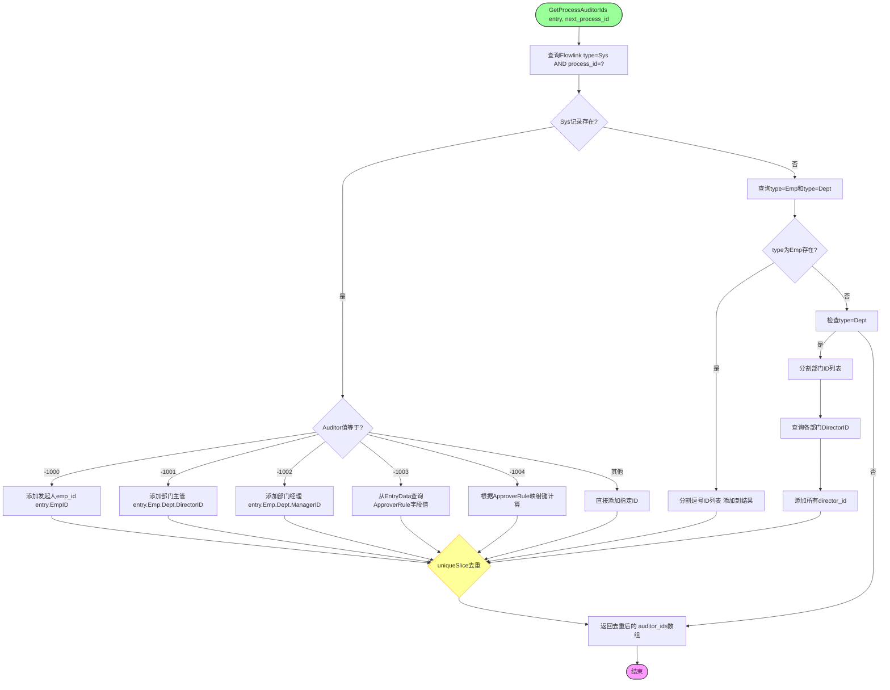
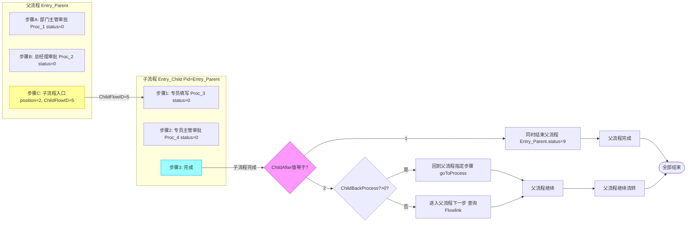
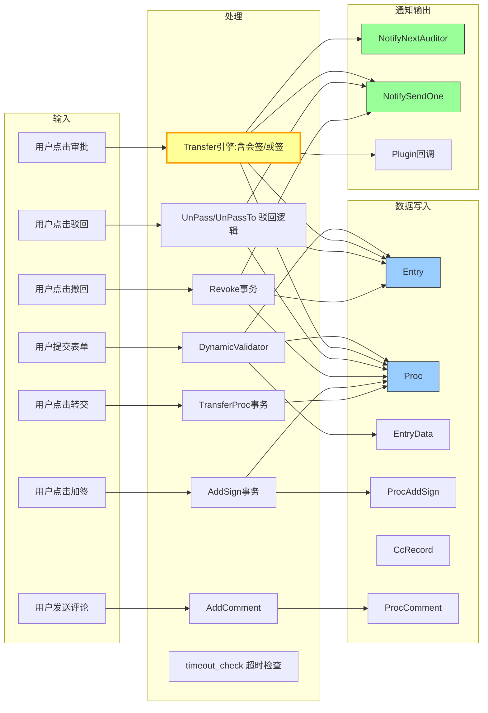
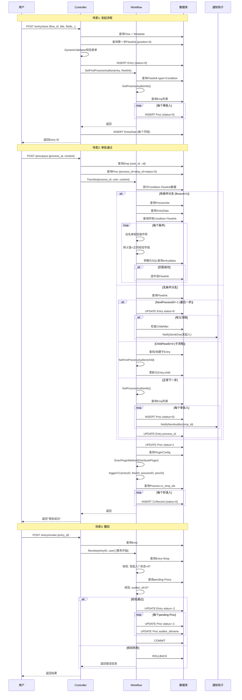

# goravel-workflow — Workflow Engine Extension Pack

This is a workflow engine library built on top of `github.com/goravel/framework`. It provides complete approval workflow capabilities including consensus signing (会签), any-sign (或签), rejection, addition/transfer of signers, comments, CC, and timeout checking.

## Directory Structure

```
goravel-workflow/
├── workflow.go              # Entry: ServiceProvider registers routes, migrations, config, commands
├── service_provider.go      # Goravel service provider
├── config/workflow.go       # Config file template (published during setup)
├── contracts/workflow.go    # Workflow interface definition
├── migrations/              # DB migration files (11+ workflow tables)
├── seeders/                 # Seeder data (dept, emp, flow type initialization)
├── models/                  # Data models (Entry, Proc, Flow, Flowlink, Process, etc.)
├── services/workflow/       # Core workflow engine (~1115 lines: Transfer/Pass/UnPass, etc.)
├── services/workflow/official_plugins/  # Plugin system (DistributePlugin, etc.)
├── controllers/             # API controllers (auth, entry, proc, flow, template, etc.)
├── routes/api.go            # API route registration
├── commands/                # Artisan commands (publish, timeout-check, plugin)
├── middleware/jwt.go        # JWT middleware
├── requests/                # Request validation structs
├── rules/                   # Custom validation rules
└── docs/                    # Workflow logic documentation (mermaid diagrams)
```

## Architecture

Core model chain: **Flow → Process → Entry → Proc**

- **Flow** — A workflow definition (e.g., "leave request", "expense approval")
- **Process** — Steps within a flow
- **Flowlink** — Connections between processes (who approves, concurrency type)
- **Entry** — A specific workflow instance (e.g., "John's leave request #123")
- **Proc** — An individual approval task within an entry
- **EntryData** — Form field values submitted with an entry

### Data Models

#### Flow (`models/flow.go`)

| Field | Description |
|-------|-------------|
| `FlowNo` | Flow number |
| `FlowName` | Flow name |
| `TemplateID` | Associated form template ID |
| `IsPublish` | Whether published |
| `Jsplumb` | Flowchart JSON (jsPlumb visualization) |

#### Process (`models/process.go`)

| Field | Description |
|-------|-------------|
| `ProcessName` | Step name |
| `Position` | Step position: 0=first step, 1=normal step, 2=enter child workflow |
| `ChildFlowID` | Child flow ID (when position=2) |
| `ChildAfter` | After child completes: 1=end parent too, 2=return to parent |
| `ChildBackProcess` | Parent step ID to return to (when ChildAfter=2) |
| `LimitTime` | Time limit in seconds |
| `CcEmpIDs` | CC recipient IDs (comma-separated) |
| `AutoPerson` | Auto-approver settings |

#### Flowlink (`models/flowlink.go`)

| Field | Description |
|-------|-------------|
| `Type` | Type: `Condition`=conditional routing, `Emp`=specific employee, `Dept`=specific dept, `Sys`=system auto |
| `Auditor` | Approver setting (see special values below) |
| `ApproverRule` | Approver rule: for -1003 stores form field name, for -1004 stores expression mapping key |
| `ConcurrencyType` | Concurrency mode: 0=sequential, 1=consensus, 2=any-sign |
| `Expression` | Condition expression (JSON), "1" means unconditional |
| `Sort` | Evaluation order |
| `NextProcessID` | Next step ID (-1 = last step) |

#### Entry (`models/entry.go`)

| Field | Description |
|-------|-------------|
| `Title` | Instance title |
| `FlowID` | Belonging flow |
| `EmpID` | Initiator ID |
| `Status` | Status (see status codes below) |
| `Pid` | Parent entry ID (child workflow marker) |
| `Circle` | Round number (increments on resend) |
| `ProcessID` | Current step |
| `EnterProcessID` | Entry step ID |
| `EnterProcID` | Entry task ID |
| `Child` | Child workflow current step |

#### Proc (`models/proc.go`)

| Field | Description |
|-------|-------------|
| `EntryID` | Belonging instance |
| `ProcessID` | Current step |
| `EmpID` | Assigned approver |
| `Status` | Status (see status codes below) |
| `Content` | Approval content |
| `Concurrence` | Creation time (for parallel approval lookup) |
| `IsRead` | Whether viewed |
| `IsReal` | Whether approver == operator |
| `UnpassTargetProcessID` | Target step for rejection |

#### Auxiliary Models
- **ProcComment** — Comments/discussions during approval
- **CcRecord** — CC records created after approval
- **ProcAddSign** — Addition signer records (before/after)
- **EntryData** — Form field data
- **ProcessVar** — Step variables (for conditional evaluation)

## Special Values & Status Codes

### Flowlink.Auditor Special Values
| Value | Meaning |
|-------|---------|
| -1000 | Initiator themselves |
| -1001 | Department director |
| -1002 | Department manager |
| -1003 | Read approver from form field (ApproverRule stores field name) |
| -1004 | Dynamic expression (ApproverRule stores mapping key) |

### Flowlink.ConcurrencyType
| Value | Meaning |
|-------|---------|
| 0 | Sequential (default) |
| 1 | Consensus (会签) — all approvers must approve |
| 2 | Any-sign (或签) — first approver wins, others skipped |

### Flowlink.Type
| Value | Meaning |
|-------|---------|
| Condition | Conditional routing |
| Emp | Specific employee |
| Dept | Specific department |
| Sys | System auto |

### Entry.Status
| Value | Meaning |
|-------|---------|
| 0 | In progress |
| 9 | Completed |
| -1 | Rejected |
| -2 | Revoked |

### Proc.Status
| Value | Meaning |
|-------|---------|
| 0 | Pending |
| 1 | Approved |
| -1 | Rejected |
| -2 | Revoked |
| 3 | Transferred |
| 4 | Skipped (any-sign) |
| 9 | Consensus approved (auto-approved first step) |

### Process.Position
| Value | Meaning |
|-------|---------|
| 0 | First step |
| 1 | Normal step |
| 2 | Enter child workflow |

### Process.ChildAfter
| Value | Meaning |
|-------|---------|
| 1 | End parent workflow when child completes |
| 2 | Return to parent workflow when child completes |

## Integration Steps

### 1. Register ServiceProvider
In target project's `config/app.go`:
```go
import "your/module/path/goravel-workflow"

func init() {
    "providers": []foundation.ServiceProvider{
        // ... existing providers
        &workflow.ServiceProvider{},
    }
}
```

### 2. Publish Resources
```bash
go run . artisan vendor:publish --package=your-module-path/goravel-workflow
```
Optional tags: `--tag=migrations`, `--tag=config`, `--tag=seeders`

### 3. Database Setup
The package provides migrations for workflow-specific tables (flows, flowtypes, processes, entries, procs, etc.). It does **NOT** create `users`, `depts`, or `emps` tables — those must exist in the host application.

Run migrations:
```bash
go run . artisan migrate --seed
```

### 4. Implement User Hook Interface
Add a `Workflow` field to your User model, then implement two methods:

```go
type User struct {
    orm.Model
    Name     string
    WorkNo   string
    Password string
    // ... other fields
    Workflow *workflow.Workflow
    orm.SoftDeletes
}

// Called when entry is rejected or process completes
func (u *User) NotifySendOne(id uint) error {
    // Send notification to initiator
    return nil
}

// Called when next approver is assigned after approval
func (u *User) NotifyNextAuditor(id uint) error {
    // Send notification to next approver
    return nil
}
```

### 5. Configure Model Mapping
After publishing, edit `config/workflow.go`:
```go
"Dept": "Department", // Model name for departments in your app
"Emp":  "User",       // Model name for employees in your app
```

### 6. Register Hooks
In your `AppServiceProvider.Boot()`:
```go
wf := workflow.NewBaseWorkflow()
user := &models.User{Workflow: wf}
wf.RegisterHook("NotifySendOneHook", reflect.ValueOf(user.NotifySendOne))
wf.RegisterHook("NotifyNextAuditorHook", reflect.ValueOf(user.NotifyNextAuditor))
```

### 7. Check Route Conflicts
The package registers many `/api/*` routes. Check for conflicts before starting.

## Core Business Logic

### 1. Create Entry (发起流程)

**Entry:** `EntryController.Store()`

1. Query Flow + Template + TemplateForms by `flow_id`
2. Find first Flowlink (`position=0`, ordered by sort)
3. Validate form data via `DynamicValidator` (rules from Template)
4. Create Entry record (`status=0`)
5. Call `SetFirstProcessAuditor(entry, flowlink)`:
   - Query Flowlinks for this step (type != Condition)
   - If none found (ID=0), auto-create a Proc with status=9 (approved) and advance to next step
   - Calculate approver IDs via `GetProcessAuditorIds()`
   - Query Emp records for each approver
   - Create Proc tasks (status=0) for each approver
   - Update Entry.ProcessID
6. Save EntryData records for each form field
7. Return Entry

### 2. Approval Transfer (审批流转) — Core Engine

**Entry:** `ProcController.Pass()` → `Workflow.Pass()` → `Workflow.Transfer(process_id, user, content)`

1. Resolve user to Emp (via user_id)
2. Find current pending Proc (process_id + emp_id + status=0)
3. Query Flowlink.ConcurrencyType:

   - **Consensus (会签, type=1):**
     - Count total procs, approved procs, rejected procs
     - If not all done → mark current as approved, return (wait for others)
     - If all done and any rejected → reject entire entry (`handleRejectEntry`)
     - If all done and all approved → continue

   - **Any-sign (或签, type=2):**
     - Mark all other pending procs at same step as skipped (status=4)
     - Continue

   - **Sequential (依次, type=0):**
     - Continue normally

4. Check for conditional branches (Count Flowlinks where type=Condition):

   **With conditions (fkcount > 1):**
   - Query ProcessVar for condition field name
   - Query EntryData for field values
   - Iterate Condition Flowlinks:
     - Expression="1" → unconditional match
     - Parse JSON → ProcessCondition[] with whitelist validation (=, !=, >, <, >=, <=, like, in, not in, between)
     - Escape single quotes in values
     - Regex-validate field names (alphanumeric + underscore only)
     - Build parameterized SQL query against entrydatas
     - First matching Flowlink wins

   **Without conditions (fkcount <= 1):**
   - Query Flowlink for NextProcessID

5. Handle NextProcessID:

   **-1 (last step):**
   - Update Entry status=9 (completed)
   - If has parent workflow:
     - ChildAfter=1 → end parent too, notify initiator
     - ChildAfter=2 → return to parent (goToProcess or next step)

   **ChildFlowID > 0 (child workflow):**
   - Find or create child Entry (pid=parent entry id)
   - Initialize child's first Flowlink
   - Call `SetFirstProcessAuditor(child_entry)`
   - Update parent Entry.child field

   **Normal next step:**
   - Calculate approver IDs via `GetProcessAuditorIds()`
   - Create new Proc tasks (status=0)
   - Notify next approvers (NotifyNextAuditor)
   - Update Entry.process_id

6. Mark current Proc as approved (status=1)
7. Execute plugins: `ExecPluginMethod("DistributePlugin", flowID, processID)`
8. Trigger CC: `triggerCC()` — creates CcRecord for each cc_emp_ids

### 3. Rejection (驳回)

**a) Simple Reject (UnPass — reject to previous step):**
1. Find pending Proc at same Entry/Process/Circle
2. If none found → reject entire entry directly
3. Mark todoProc status=-1 (rejected)
4. Update Entry status=-1
5. If has parent → sync parent status=-1
6. Notify initiator (NotifySendOne)

**b) Reject to Specific Node (UnPassTo — arbitrary node rejection):**
1. Find target Proc at targetProcessID:
   - First check pending procs at that step
   - If not found → query all procs (order by id DESC)
2. If target doesn't exist → error
3. Mark all procs between target and current as skipped (status=4)
4. Reset target Proc to pending (status=0)
5. Update Entry: status=0, ProcessID=target
6. Notify target approver + initiator

### 4. Withdrawal (撤回)

**Entry:** Only the initiator can withdraw their own pending entry.

1. Transaction begins
2. Verify: Entry exists, user == initiator, Entry.status == 0
3. Verify: No proc has been handled yet (all pending procs have auditor_id=0)
4. Update Entry status=-2 (revoked)
5. Batch update all pending Procs: status=-2, auditor_id/name = initiator
6. Transaction commits

### 5. Add Signer (加签)

**Entry:** Current approver can add extra approvers.

1. Transaction begins
2. Verify: Entry exists and status=0
3. Find current user's pending Proc at this step
4. Query target Emp
5. Create ProcAddSign record (sign_type: "before"/"after")
6. Create new Proc for the added signer (status=0)
7. Transaction commits

### 6. Transfer (转交)

**Entry:** Current approver transfers their task to someone else.

1. Transaction begins
2. Verify: Proc exists, belongs to entry, status=0 (pending)
3. Verify: Entry status=0
4. Query target Emp
5. Create new Proc for transferee (status=0)
6. Mark original Proc: status=3 (transferred), content="已转交给{name}"
7. Transaction commits

### 7. Comments (评论)

- `AddComment`: Create ProcComment record (status=1)
- `GetComments`: Query all comments for entry_id, ordered by ID ASC

### 8. CC (抄送)

Triggered automatically after `Transfer()` completes:
1. Query Process.CcEmpIDs
2. Query corresponding Emp records
3. Create CcRecord (status=0 unread) for each

### 9. Child Workflows (子流程)

When a Process has Position=2 and ChildFlowID > 0:
1. Find existing child Entry (pid=parent AND circle=parent.circle) or create new one
2. Query child's first Flowlink (position=0, no Condition type)
3. Call `SetFirstProcessAuditor(child_entry)` — same as initial creation
4. Update parent Entry.child = child's current process

**Parent-child linkage on child completion:**
- ChildAfter=1 → Parent also ends (status=9), notify initiator
- ChildAfter=2 → Return to parent:
  - ChildBackProcess > 0 → goToProcess(parent, ChildBackProcess)
  - Otherwise → parent's next step via Flowlink

### 10. Timeout Check (超时检查)

Scheduled command: `workflow:timeout-check` (run via system cron periodically)
1. Query all pending Procs (status=0)
2. For each: check Process.LimitTime (seconds)
3. If LimitTime > 0 and elapsed > LimitTime:
   - Mark Proc status=-1, content="超时未处理，系统自动驳回"
   - Update Entry status=-1
   - Log details

## Approver Calculation Logic (GetProcessAuditorIds)

For a given process step, calculate approver IDs:

1. Query Flowlink with type=Sys (system auto):
   - Auditor="-1000" → add initiator's emp_id
   - Auditor="-1001" → add entry.Emp.Dept.DirectorID
   - Auditor="-1002" → add entry.Emp.Dept.ManagerID
   - Auditor="-1003" → read ApproverRule as field name, query EntryData for value
   - Auditor="-1004" → use ApproverRule as mapping key ("director"/"manager"/numeric ID)
   - Other numeric → add directly

2. If no Sys type, query type=Emp:
   - Split comma-separated IDs, add each

3. If no Emp type, query type=Dept:
   - Split comma-separated dept IDs
   - Query each dept's DirectorID
   - Add all directors

4. Deduplicate via `uniqueSlice()` and return

## Transaction Boundaries

| Operation | Transaction |
|-----------|-------------|
| `Transfer()` | Non-transactional (individual sub-ops may use transactions) |
| `Revoke()` | Full transaction (Entry + all pending Procs) |
| `AddSign()` | Full transaction (ProcAddSign + new Proc) |
| `TransferProc()` | Full transaction (new Proc + mark old) |
| `SetFirstProcessAuditor()` | Uses outer transaction (no nested) |

## Security & Engineering

### SQL Injection Prevention
- Operator whitelist: only `=, !=, >, <, >=, <=, like, in, not in, between`
- Single quotes escaped in values
- Field names validated via regex: `^[a-zA-Z0-9_]+$`
- Parameterized queries with `?` placeholders

### Concurrency Safety
- `sync.RWMutex` protects hooks map (concurrent reads allowed)
- Nil-safe: Workflow methods return errors instead of panicking on nil receiver

### Performance
- Composite indexes on: procs(status, entry_id), procs(emp_id, status), entrydatas(entry_id, field_name), entry(status), entry(flow_id, status)

## Key Services

### Workflow Engine (`services/workflow/workflow.go`)
- `NewBaseWorkflow()` — Singleton instance (sync.Once)
- `RegisterHook(name, method)` — Register callback hooks
- `Transfer(processID, user, content)` — Approve and move to next step
- `Pass(processID, user, content)` — Alias for Transfer
- `UnPass(procID, user, content)` — Reject to previous step
- `UnPassTo(procID, user, content, targetProcessID)` — Reject to specific node
- `Revoke(entryID, user)` — Initiator withdraws their own pending entry
- `AddSign(entryID, processID, signEmpID, signType, currentUser)` — Add extra approver
- `TransferProc(entryID, procID, targetEmpID, currentUser)` — Transfer approval to someone else
- `AddComment(entryID, procID, empID, empName, content)` — Add comment
- `GetComments(entryID)` — Get all comments for an entry
- `ExecPluginMethod(pluginName, flowID, processID)` — Execute plugin

### Controllers (`controllers/`)
All under `/api` prefix with JWT middleware. Key endpoints:

| Endpoint | Method | Description |
|----------|--------|-------------|
| `/api/auth/login` | POST | Admin login |
| `/api/h5/login` | POST | H5 login |
| `/api/captcha/get` | GET | Get captcha |
| `/api/captcha/validate` | POST | Validate captcha |
| `/api/upload` | POST | File upload |
| `/api/dept` | CRUD | Department management |
| `/api/emp` | CRUD | Employee management |
| `/api/flow` | CRUD | Flow definition management |
| `/api/flow/publish` | POST | Publish flow |
| `/api/flow/{id}/entry` | GET | Create entry form |
| `/api/entry` | POST | Submit entry |
| `/api/entry/{id}` | GET | Show entry |
| `/api/entry/resend` | POST | Resend entry |
| `/api/entry/revoke` | POST | Revoke entry |
| `/api/pass` | POST | Approve |
| `/api/unpass` | POST | Reject |
| `/api/revoke` | POST | Revoke (alias) |
| `/api/addsign` | POST | Add signer |
| `/api/transfer` | POST | Transfer |
| `/api/comment` | POST | Add comment |
| `/api/comments/{entry_id}` | GET | Get comments |
| `/api/cc/list` | GET | CC list |
| `/api/cc/entry/{entry_id}` | GET | Entry CC records |
| `/api/process/attribute` | GET | Process attributes |
| `/api/process/con` | POST | Process conditions |
| `/api/process/list` | POST | Process list |

### Commands
- `workflow:publish` — Publish workflow resources
- `workflow:timeout-check` — Check overdue pending tasks
- `plugin` — Plugin management

## Important Notes

1. **Global App singleton**: `service_provider.go` sets `var App foundation.Application` globally. This is fine for Goravel apps but be aware if testing in isolation.

2. **Models expect specific fields**: The `Emp` model expects columns `name`, `workno`, `email`, `password`, `dept_id`, `leave`, `user_id`. The `Dept` model expects `director_id`, `manager_id`. Ensure your host app's tables match these.

3. **Config init() conflict**: Both `config/workflow.go` in the package and the published config call `config.Add("workflow", ...)`. The published version takes precedence once copied.

4. **Plugin system**: `official_plugins/` provides a `DistributePlugin` mechanism. Plugins are registered per-process and executed on approval via `ExecPluginMethod()`.

5. **Child workflows**: The engine supports nested/child workflows via `Flowlink.Process.ChildFlowID`. When a process has a child flow ID, a new Entry is created with `pid` pointing to the parent.

6. **Route naming**: The package uses standard Goravel resource routing (`router.Resource`). Check for conflicts with existing routes in the host application.

7. **JWT middleware**: All workflow routes require JWT authentication via `middleware.Jwt()`. Ensure the host app has JWT configured.

## Debugging & Troubleshooting (from docs/)

### System Architecture

```mermaid
graph TB
    subgraph "前端层"
        A[Web/App] --> B[API Router]
    end
    
    subgraph "控制器层 controllers/"
        B --> C1[EntryController 发起/查询/重发/撤回]
        B --> C2[ProcController 审批/驳回/加签/转交/评论]
        B --> C3[CcController 抄送列表/查询]
    end
    
    subgraph "服务层 services/workflow/"
        C1 --> W[Workflow Singleton 单例模式 + 钩子系统]
        C2 --> W
        C3 -.-> CC[triggerCC 抄送触发器]
        
        W --> H1[SetFirstProcessAuditor 初始化审批链]
        W --> H2[Transfer 核心流转引擎]
        W --> H3[UnPass/UnPassTo 驳回/驳回到指定节点]
        W --> H4[Revoke 撤回]
        W --> H5[AddSign 加签]
        W --> H6[TransferProc 转交]
        W --> H7[AddComment/GetComments 评论]
        W --> H8[getProcessAuditorIds 计算审批人]
        
        H2 --> S1[并签模式检查 会签/或签/依次]
        H2 --> S2[条件分支解析 白名单+参数化SQL]
        H2 --> S3[子流程处理 ChildFlowID]
        H2 --> S4[父子联动 ChildAfter]
        
        W --> P[PluginCollector 插件执行]
    end
    
    subgraph "数据层 models/"
        W --> DB[(SQLite/MySQL)]
        
        DB --> M1[Flow 流程定义]
        DB --> M2[Process 步骤定义]
        DB --> M3[Flowlink 流转关系]
        DB --> M4[Entry 流程实例]
        DB --> M5[Proc 审批任务]
        DB --> M6[EntryData 表单数据]
        DB --> M7[ProcComment 评论]
        DB --> M8[CcRecord 抄送记录]
        DB --> M9[ProcAddSign 加签记录]
        DB --> M10[ProcessVar 条件变量]
    end
    
    subgraph "辅助模块"
        W --> Aux1[DynamicValidator 动态校验]
        W --> Aux2[PluginConfig 插件配置]
        W --> Aux3[timeout_check 定时检查]
    end
    
    style W fill:#f9f,stroke:#333,stroke-width:4px
    style H2 fill:#ff9,stroke:#333,stroke-width:3px
    style DB fill:#9cf,stroke:#333,stroke-width:2px
```



### Transfer Core Decision Tree



### State Machine



### Approver Calculation Logic



### Child Workflow & Parent-Child Linkage



### Data Flow Overview



### Request Lifecycle Sequence



### Transaction Boundaries


### Troubleshooting Guide

#### 审批人计算问题
1. 检查 Flowlink 表中目标 ProcessID 的记录是否存在
2. 确认 Type 字段（Sys/Emp/Dept）是否正确
3. 如果是 Auditor=-1003/-1004，检查 ApproverRule 字段值与 EntryData 是否匹配
4. 检查 Emp 表中对应 ID 的记录是否存在，以及 DeptID 是否正确
5. 查看 `services/workflow/workflow.go:268` 的 `GetProcessAuditorIds` 方法日志

#### 流程无法流转
1. 检查 Entry.Status 是否为 0（进行中）
2. 检查 Proc 是否存在且 status=0（待处理），emp_id 是否对应当前用户
3. 检查 Flowlink.NextProcessID 是否正确设置
4. 如果有条件分支，检查 ProcessVar.ExpressionField 是否与 EntryData.field_name 匹配
5. 检查 Condition Flowlink 的 Expression 是否为合法 JSON

#### 会签/或签异常
1. 会签：检查同一步骤下 Proc 数量是否与 Flowlink 定义的审批人数量一致
2. 或签：检查被跳过的 Proc 是否正确标记为 status=4
3. 查看 `checkConsensusComplete()` 和 `skipRemainingConcurrentProcs()` 方法

#### 子流程问题
1. 检查 Process.Position 是否为 2
2. 检查 Process.ChildFlowID 是否正确指向子 Flow
3. 检查 Entry.Pid 是否正确关联父子流程
4. 检查 ChildAfter 和 ChildBackProcess 配置

#### 超时检查不生效
1. 确认 Process.LimitTime > 0
2. 确认 Proc.Concurrence 有时间值
3. 确认 `workflow:timeout-check` 命令已正确注册并定期执行
4. 检查 commands/timeout_check.go 的实现

#### Hook 未触发
1. 确认在 AppServiceProvider.Boot() 中调用了 RegisterHook
2. 确认 Hook 名称与调用时使用的名称完全一致
3. 确认方法签名是否为 func(uint) error
4. 查看 services/workflow/hook.go 和 invokeHooks 方法的日志输出

#### 路由冲突
1. 启动项目时报路由重复错误，检查目标项目的 routes/api.go
2. 工作流注册的路由见 routes/api.go
3. 可能需要修改目标项目的路由前缀或工作流的 Controller 前缀
