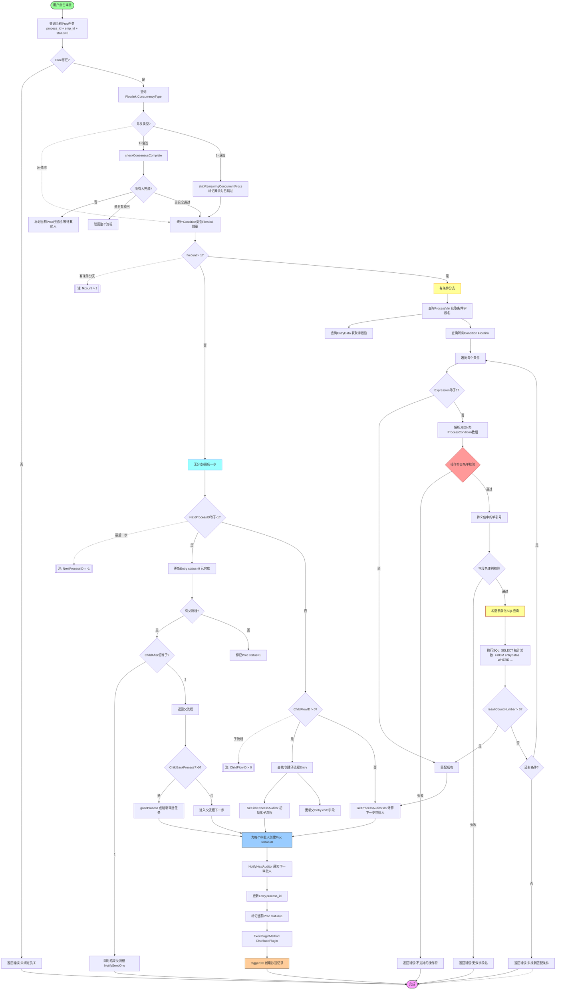
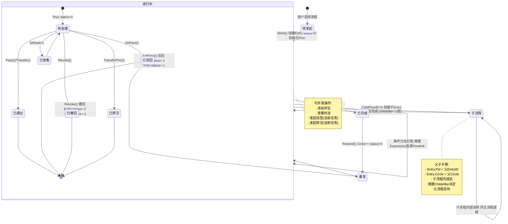
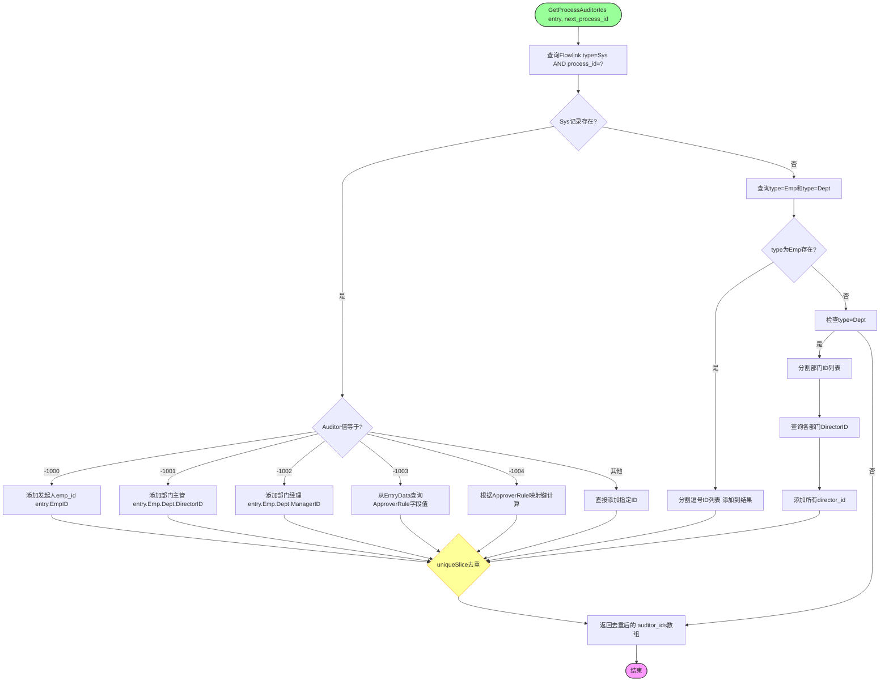
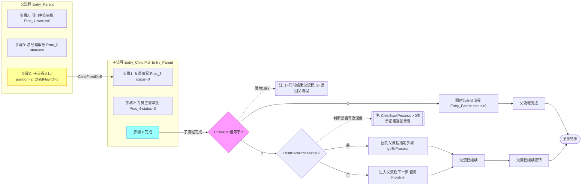
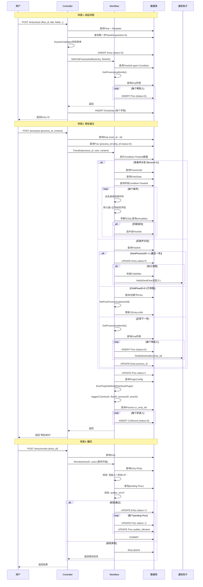
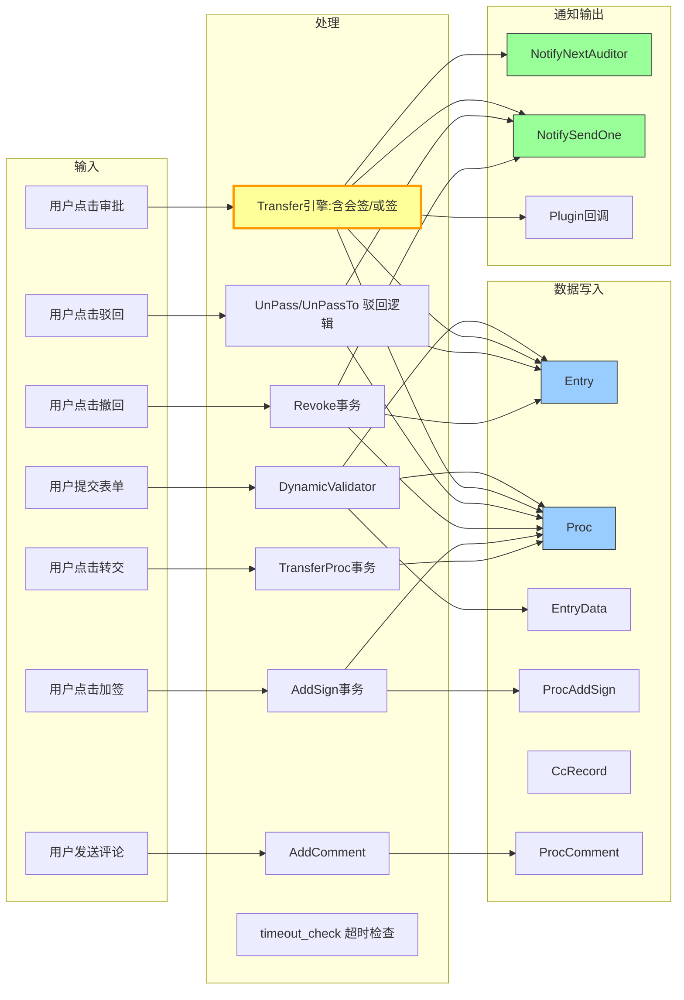

# 审批流工作引擎 — 完整架构与流程时序图

## 一、系统整体架构图

```mermaid
graph TB
    subgraph "前端层"
        A[Web/App] --> B[API Router]
    end
    
    subgraph "控制器层 controllers/"
        B --> C1[EntryController 发起/查询/重发/撤回]
        B --> C2[ProcController 审批/驳回/加签/转交/评论]
        B --> C3[CcController 抄送列表/查询]
    end
    
    subgraph "服务层 services/workflow/"
        C1 --> W[Workflow Singleton 单例模式 + 钩子系统]
        C2 --> W
        C3 -.-> CC[triggerCC 抄送触发器]
        
        W --> H1[SetFirstProcessAuditor 初始化审批链]
        W --> H2[Transfer 核心流转引擎]
        W --> H3[UnPass/UnPassTo 驳回/驳回到指定节点]
        W --> H4[Revoke 撤回]
        W --> H5[AddSign 加签]
        W --> H6[TransferProc 转交]
        W --> H7[AddComment/GetComments 评论]
        W --> H8[getProcessAuditorIds 计算审批人]
        
        H2 --> S1[并签模式检查 会签/或签/依次]
        H2 --> S2[条件分支解析 白名单+参数化SQL]
        H2 --> S3[子流程处理 ChildFlowID]
        H2 --> S4[父子联动 ChildAfter]
        
        W --> P[PluginCollector 插件执行]
    end
    
    subgraph "数据层 models/"
        W --> DB[(SQLite/MySQL)]
        
        DB --> M1[Flow 流程定义]
        DB --> M2[Process 步骤定义]
        DB --> M3[Flowlink 流转关系]
        DB --> M4[Entry 流程实例]
        DB --> M5[Proc 审批任务]
        DB --> M6[EntryData 表单数据]
        DB --> M7[ProcComment 评论]
        DB --> M8[CcRecord 抄送记录]
        DB --> M9[ProcAddSign 加签记录]
        DB --> M10[ProcessVar 条件变量]
    end
    
    subgraph "辅助模块"
        W --> Aux1[DynamicValidator 动态校验]
        W --> Aux2[PluginConfig 插件配置]
        W --> Aux3[timeout_check 定时检查]
    end
    
    style W fill:#f9f,stroke:#333,stroke-width:4px
    style H2 fill:#ff9,stroke:#333,stroke-width:3px
    style DB fill:#9cf,stroke:#333,stroke-width:2px
```

## 二、核心流转决策树（Transfer函数）

```mermaid
graph TD
    Start([用户点击审批]) --> QueryProc[查询当前Proc任务 process_id + emp_id + status=0]
    QueryProc --> CheckProc{Proc存在?}
    CheckProc -->|否| Err1[返回错误:未绑定员工]
    CheckProc -->|是| CheckConcurrency[查询Flowlink.ConcurrencyType]
    
    CheckConcurrency --> ConcType{并发类型?}
    ConcType -.->|0=依次| CountCondition[统计Condition类型Flowlink数量]
    
    ConcType -->|1=会签| CheckConsensus[checkConsensusComplete]
    CheckConsensus --> AllDone{所有人完成?}
    AllDone -->|否| MarkApproved[标记当前Proc已通过,等待其他人]
    AllDone -->|是且有驳回| HandleRejectEntry[驳回整个流程]
    AllDone -->|是且全通过| CountCondition
    
    ConcType -->|2=或签| SkipOthers[skipRemainingConcurrentProcs标记其余为已跳过]
    SkipOthers --> CountCondition
    
    CountCondition --> Branch{fkcount > 1?}
    Branch -.->|有条件分支| HasBranchNote[[注: fkcount > 1]]
    
    Branch -->|否| NoBranch[无分支/最后一步]
    NoBranch --> CheckLast{NextProcessID等于-1?}
    CheckLast -.->|最后一步| LastNote[[注: NextProcessID = -1]]
    
    CheckLast -->|是| FinishEntry[更新Entry status=9 已完成]
    FinishEntry --> CheckParent{有父流程?}
    CheckParent -->|是| CheckChildAfter{ChildAfter值等于?}
    CheckParent -->|否| CommonStep[标记Proc status=1]
    
    CheckChildAfter -->|1| EndBoth[同时结束父流程 NotifySendOne]
    CheckChildAfter -->|2| BackToParent[返回父流程]
    BackToParent --> CheckBackProc{ChildBackProcess?>0?}
    CheckBackProc -->|是| GoToProcess[goToProcess 创建新审批任务]
    CheckBackProc -->|否| ParentNext[进入父流程下一步]
    
    CheckLast -->|否| CreateChild{ChildFlowID > 0?}
    CreateChild -.->|子流程| ChildNote[[注: ChildFlowID > 0]]
    CreateChild -->|是| ChildEntry[查找/创建子流程Entry]
    ChildEntry --> ChildInit[SetFirstProcessAuditor 初始化子流程]
    ChildEntry --> UpdateChild[更新父Entry.child字段]
    CreateChild -->|否| CalcAuditors[GetProcessAuditorIds 计算下一步审批人]
    
    Branch -->|是| HasBranch[有条件分支]
    HasBranch --> QueryPVar[查询ProcessVar 获取条件字段名]
    QueryPVar --> QueryEData[查询EntryData 获取字段值]
    QueryPVar --> QueryFLinks[查询所有Condition Flowlink]
    
    QueryFLinks --> LoopConditions[遍历每个条件]
    LoopConditions --> CheckExpr{Expression等于1?}
    CheckExpr -->|是| MatchFound[匹配成功]
    CheckExpr -->|否| ParseJSON[解析JSON为ProcessCondition数组]
    
    ParseJSON --> ValidateOps{操作符白名单校验}
    ValidateOps -->|失败| Err2[返回错误:不支持的操作符]
    ValidateOps -->|通过| EscapeValue[转义值中的单引号]
    EscapeValue --> ValidateField{字段名正则校验}
    ValidateField -->|失败| Err3[返回错误:无效字段名]
    ValidateField -->|通过| BuildSQL[构造参数化SQL查询]
    
    BuildSQL --> ExecSQL[执行SQL: SELECT 统计总数  FROM entrydatas WHERE ...]
    ExecSQL --> CheckResult{resultCount.Number > 0?}
    CheckResult -->|是| MatchFound
    CheckResult -->|否| NextCondition{还有条件?}
    NextCondition -->|是| LoopConditions
    NextCondition -->|否| Err4[返回错误:未找到匹配条件]
    
    MatchFound --> CalcAuditors
    
    GoToProcess --> CreateProcs[为每个审批人创建Proc status=0]
    ParentNext --> CreateProcs
    ChildInit --> CreateProcs
    CalcAuditors --> CreateProcs
    
    CreateProcs --> NotifyNext[NotifyNextAuditor 通知下一审批人]
    NotifyNext --> UpdateEntry[更新Entry.process_id]
    UpdateEntry --> MarkDone[标记当前Proc status=1]
    MarkDone --> ExecPlugin[ExecPluginMethod DistributePlugin]
    ExecPlugin --> TriggerCC[triggerCC 创建抄送记录]
    TriggerCC --> End([完成])
    
    Err1 --> End
    Err2 --> End
    Err3 --> End
    Err4 --> End
    EndBoth --> End
    Err4 -.-> End
    
    style Start fill:#9f9,stroke:#333
    style End fill:#f9f,stroke:#333
    style HasBranch fill:#ff9,stroke:#f90
    style NoBranch fill:#9ff,stroke:#09f
    style ValidateOps fill:#f99,stroke:#900
    style BuildSQL fill:#ff9,stroke:#900
    style CreateProcs fill:#9cf,stroke:#333
    style TriggerCC fill:#fc9,stroke:#333
```

## 三、状态机转换图

```mermaid
stateDiagram-v2
    [*] --> 待发起: 用户选择流程
    
    待发起 --> 进行中: Store() 创建Entry status=0 初始化Proc
    
    进行中 --> 已完成: Transfer() 最后一步 Entry.status=9
    
    进行中 --> 已驳回: UnPass() 驳回 Entry.status=-1 Proc.status=-1
    
    进行中 --> 已撤回: Revoke() 撤回 Entry.status=-2 Proc.status=-2
    
    进行中 --> 进行中: Pass() 审批通过 创建新Proc 更新Entry.process_id
    
    进行中 --> 进行中: UnPassTo(targetProcessID) 驳回到指定节点
    
    进行中 --> 进行中: AddSign() 加签 新增Proc
    
    进行中 --> 进行中: TransferProc() 转交 原Proc.status=3 新Proc.status=0
    
    进行中 --> 进行中: 会签模式 所有人通过后继续
    
    进行中 --> 进行中: 或签模式 一人通过后其余跳过
    
    进行中 --> 进行中: 条件分支匹配 根据Expression选择Flowlink
    
    进行中 --> 子流程: ChildFlowID>0 创建子Entry Pid=父EntryID
    
    子流程 --> 进行中: 子流程完成 ChildAfter=1或2
    
    子流程 --> 子流程: 子流程内部流转 同主流程逻辑
    
    state 进行中 {
        [*] --> 待处理: Proc.status=0
        待处理 --> 已查看: IsRead=1
        已查看 --> 待处理
        待处理 --> 已通过: Pass()/Transfer()
        待处理 --> 已驳回: UnPass()
        待处理 --> 已撤回: Revoke()
        待处理 --> 已转交: TransferProc()
        已通过 --> [*]
        已驳回 --> [*]
        已撤回 --> [*]
        已转交 --> [*]
    }
    
    已完成 --> 重发: Resend() Circle++ status=0
    已驳回 --> 重发
    重发 --> 进行中
    
    note right of 进行中
        可并发操作:
        - 添加评论
        - 查看抄送
        - 发起加签(当前任务)
        - 发起转交(当前任务)
    end note
    
    note right of 子流程
        父子关联:
        - Entry.Pid = 父EntryID
        - Entry.Circle = 父Circle
        - 子流程完成后
          根据ChildAfter决定
          父流程走向
    end note
```

## 四、审批人计算逻辑（GetProcessAuditorIds）

```mermaid
graph TD
    Start([GetProcessAuditorIds entry, next_process_id]) --> QuerySys[查询Flowlink type=Sys AND process_id=?]
    
    QuerySys --> CheckSys{Sys记录存在?}
    
    CheckSys -->|是| CheckAuditor{Auditor值等于?}
    CheckSys -->|否| QueryEmpDept[查询type=Emp和type=Dept]
    
    CheckAuditor -->|-1000| AddInitiator[添加发起人emp_id entry.EmpID]
    CheckAuditor -->|-1001| AddDirector[添加部门主管 entry.Emp.Dept.DirectorID]
    CheckAuditor -->|-1002| AddManager[添加部门经理 entry.Emp.Dept.ManagerID]
    CheckAuditor -->|-1003| QueryForm[从EntryData查询ApproverRule字段值]
    CheckAuditor -->|-1004| DynamicExpr[根据ApproverRule映射键计算]
    CheckAuditor -->|其他| AddDirect[直接添加指定ID]
    
    AddInitiator --> Dedup
    AddDirector --> Dedup
    AddManager --> Dedup
    QueryForm --> Dedup
    DynamicExpr --> Dedup
    AddDirect --> Dedup
    
    QueryEmpDept --> CheckEmp{type为Emp存在?}
    CheckEmp -->|是| SplitEmp[分割逗号ID列表 添加到结果]
    CheckEmp -->|否| CheckDept[检查type=Dept]
    
    SplitEmp --> Dedup
    CheckDept -->|是| SplitDept[分割部门ID列表]
    CheckDept -->|否| ReturnResult
    
    SplitDept --> QueryDeptDir[查询各部门DirectorID]
    QueryDeptDir --> AddDirectors[添加所有director_id]
    AddDirectors --> Dedup
    
    Dedup{uniqueSlice去重} --> ReturnResult[返回去重后的 auditor_ids数组]
    ReturnResult --> End([结束])
    
    style Start fill:#9f9,stroke:#333
    style End fill:#f9f,stroke:#333
    style Dedup fill:#ff9,stroke:#f90
```

## 五、父子流程联动机制

```mermaid
graph LR
    subgraph ParentFlow["父流程 Entry_Parent"]
        P1[步骤A: 部门主管审批 Proc_1 status=0]
        P2[步骤B: 总经理审批 Proc_2 status=0]
        P3[步骤C: 子流程入口 position=2, ChildFlowID=5]
    end
    
    subgraph ChildFlow["子流程 Entry_Child Pid=Entry_Parent"]
        C1[步骤1: 专员填写 Proc_3 status=0]
        C2[步骤2: 专员主管审批 Proc_4 status=0]
        C3[步骤3: 完成]
    end
    
    P3 -->|ChildFlowID=5| C1
    C3 -->|子流程完成| CheckCA{ChildAfter值等于?}
    
    CheckCA -.->|值为1或2| CAInfo[[注: 1=同时结束父流程, 2=返回父流程]]
    
    CheckCA -->|1| EndBoth[同时结束父流程 Entry_Parent.status=9]
    CheckCA -->|2| CheckBack{ChildBackProcess?>0?}
    
    CheckBack -.->|判断是否有返回值| CBInfo[[注: ChildBackProcess > 0表示指定返回步骤]]
    
    CheckBack -->|是| GoBack[回到父流程指定步骤 goToProcess]
    CheckBack -->|否| ParentNext[进入父流程下一步 查询Flowlink]
    
    EndBoth --> PF_end[父流程完成]
    GoBack --> PF_mid[父流程继续]
    ParentNext --> PF_mid
    
    PF_end --> Final([全部结束])
    PF_mid --> Continue[父流程继续流转]
    Continue --> Final
    
    style P3 fill:#ff9,stroke:#f90
    style C3 fill:#9ff,stroke:#09f
    style CheckCA fill:#f9f,stroke:#909
```

## 六、事务边界与一致性

```mermaid
graph TD
    subgraph Transfer事务["Transfer() 非事务包裹 部分子操作使用独立事务"]
        direction TB
        T1[查询Proc + Entry 非事务]
        T2[条件分支解析 非事务]
        T3[创建新Proc 非事务]
        T4[更新Entry.status 非事务]
        T5[标记当前Proc完成 非事务]
        T6[ExecPlugin 非事务]
        T7[triggerCC 非事务]
    end
    
    subgraph Revoke事务["Revoke() 完整事务"]
        R1[查询Entry+Emp]
        R2[校验: 发起人+状态]
        R3[查询pending Procs]
        R4[更新Entry.status=-2]
        R5[批量更新Procs.status=-2]
        R6[COMMIT]
    end
    
    subgraph AddSign事务["AddSign() 完整事务"]
        S1[查询Entry]
        S2[校验: 状态]
        S3[查询targetProc]
        S4[查询signEmp]
        S5[创建ProcAddSign]
        S6[创建新Proc]
        S7[COMMIT]
    end
    
    subgraph TransferProc事务["TransferProc() 完整事务"]
        TP1[查询targetProc]
        TP2[校验: 存在+状态]
        TP3[查询Entry]
        TP4[校验: 流程状态]
        TP5[查询targetEmp]
        TP6[创建新Proc]
        TP7[更新原Proc.status=3]
        TP8[COMMIT]
    end
    
    subgraph SetFirstProcessAuditor事务["SetFirstProcessAuditor 完整事务"]
        F1[查询Flowlink]
        F2[计算auditor_ids]
        F3[查询Emp列表]
        F4[批量创建Procs]
        F5[更新Entry.process_id]
        F6[COMMIT]
    end
    
    T1 --> T2 --> T3 --> T4 --> T5 --> T6 --> T7
    R1 --> R2 --> R3 --> R4 --> R5 --> R6
    S1 --> S2 --> S3 --> S4 --> S5 --> S6 --> S7
    TP1 --> TP2 --> TP3 --> TP4 --> TP5 --> TP6 --> TP7 --> TP8
    F1 --> F2 --> F3 --> F4 --> F5 --> F6
    
    style R6 fill:#9f9,stroke:#333
    style S7 fill:#9f9,stroke:#333
    style TP8 fill:#9f9,stroke:#333
    style F6 fill:#9f9,stroke:#333
    style T7 fill:#ff9,stroke:#f90
```

## 七、完整请求生命周期

```mermaid
sequenceDiagram
    participant U as 用户
    participant C as Controller
    participant W as Workflow
    participant DB as 数据库
    participant N as 通知钩子
    
    Note over U,DB: 场景1: 发起流程
    U->>C: POST /entry/store {flow_id, title, fields...}
    C->>DB: 查询Flow + Template
    C->>DB: 查询第一步Flowlink (position=0)
    C->>C: DynamicValidator校验表单
    C->>DB: INSERT Entry (status=0)
    C->>W: SetFirstProcessAuditor(entry, flowlink)
    W->>DB: 查询Flowlink type!=Condition
    W->>W: GetProcessAuditorIds()
    W->>DB: 查询Emp列表
    loop 每个审批人
        W->>DB: INSERT Proc (status=0)
    end
    W-->>C: 返回
    C->>DB: INSERT EntryData (每个字段)
    C-->>U: 返回Entry ID
    
    Note over U,DB: 场景2: 审批通过
    U->>C: POST /proc/pass {process_id, content}
    C->>DB: 查询Emp (user_id→id)
    C->>DB: 查询Proc (process_id+emp_id+status=0)
    C->>W: Transfer(process_id, user, content)
    W->>DB: 统计Condition Flowlink数量
    
    alt 有条件分支 (fkcount>1)
        W->>DB: 查询ProcessVar
        W->>DB: 查询EntryData
        W->>DB: 查询所有Condition Flowlink
        loop 每个条件
            W->>W: 白名单校验操作符
            W->>W: 转义值+正则校验字段
            W->>DB: 参数化SQL查询entrydatas
            alt 匹配成功
                W->>DB: 选中该Flowlink
            end
        end
    else 无条件分支
        W->>DB: 查询Flowlink
        alt NextProcessID=-1 (最后一步)
            W->>DB: UPDATE Entry status=9
            alt 有父流程
                W->>DB: 检查ChildAfter
                W->>N: NotifySendOne(发起人)
            end
        else ChildFlowID>0 (子流程)
            W->>DB: 查找/创建子Entry
            W->>W: SetFirstProcessAuditor(child)
            W->>DB: 更新父Entry.child
        else 正常下一步
            W->>W: GetProcessAuditorIds()
            W->>DB: 查询Emp列表
            loop 每个审批人
                W->>DB: INSERT Proc (status=0)
                W->>N: NotifyNextAuditor(emp_id)
            end
            W->>DB: UPDATE Entry process_id
        end
    end
    
    W->>DB: UPDATE Proc status=1
    W->>DB: 查询PluginConfig
    W->>W: ExecPluginMethod(DistributePlugin)
    W->>W: triggerCC(entryID, flowID, processID, procID)
    W->>DB: 查询Process.cc_emp_ids
    loop 每个抄送人
        W->>DB: INSERT CcRecord (status=0)
    end
    W-->>C: 返回
    C-->>U: 返回"审批成功"
    
    Note over U,DB: 场景3: 撤回
    U->>C: POST /entry/revoke {entry_id}
    C->>DB: 查询Emp
    C->>W: Revoke(entryID, user) [事务开始]
    W->>DB: 查询Entry+Emp
    W->>W: 校验: 发起人? 状态=0?
    W->>DB: 查询pending Procs
    W->>W: 校验: auditor_id=0?
    alt 校验通过
        W->>DB: UPDATE Entry status=-2
        loop 每个pending Proc
            W->>DB: UPDATE Proc status=-2
            W->>DB: UPDATE Proc auditor_id/name
        end
        W->>DB: COMMIT
    else 校验失败
        W->>DB: ROLLBACK
        W-->>C: 返回错误信息
    end
    C-->>U: 返回结果
```

## 八、数据流向总览

```mermaid
graph LR
    subgraph 输入
        A1[用户提交表单]
        A2[用户点击审批]
        A3[用户点击驳回]
        A4[用户点击撤回]
        A5[用户点击加签]
        A6[用户点击转交]
        A7[用户发送评论]
    end
    
    subgraph 处理
        B1[DynamicValidator]
        B2[Transfer引擎:含会签/或签]
        B3[UnPass/UnPassTo 驳回逻辑]
        B4[Revoke事务]
        B5[AddSign事务]
        B6[TransferProc事务]
        B7[AddComment]
        B8[timeout_check 超时检查]
    end
    
    subgraph 数据写入
        C1[Entry]
        C2[Proc]
        C3[EntryData]
        C4[ProcAddSign]
        C5[CcRecord]
        C6[ProcComment]
    end
    
    subgraph 通知输出
        D1[NotifyNextAuditor]
        D2[NotifySendOne]
        D3[Plugin回调]
    end
    
    A1 --> B1 --> C1 & C2 & C3
    A2 --> B2 --> C2 & C1
    A3 --> B3 --> C2 & C1
    A4 --> B4 --> C1 & C2
    A5 --> B5 --> C2 & C4
    A6 --> B6 --> C2
    A7 --> B7 --> C6
    
    B2 --> D1 & D2 & D3
    B3 --> D2
    B4 --> D2
    
    style B2 fill:#ff9,stroke:#f90,stroke-width:3px
    style C1 fill:#9cf,stroke:#333
    style C2 fill:#9cf,stroke:#333
    style D1 fill:#9f9,stroke:#333
    style D2 fill:#9f9,stroke:#333
```
